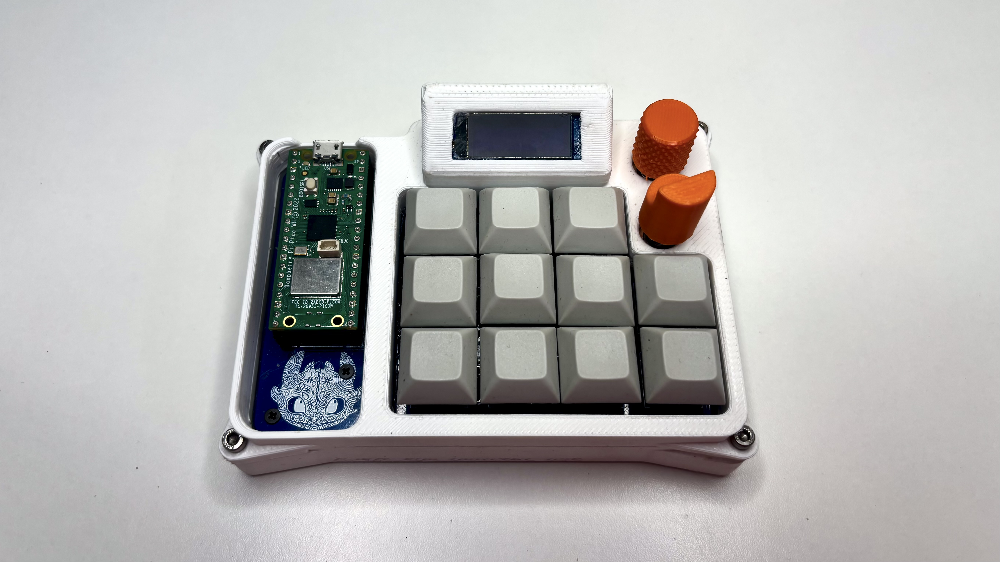
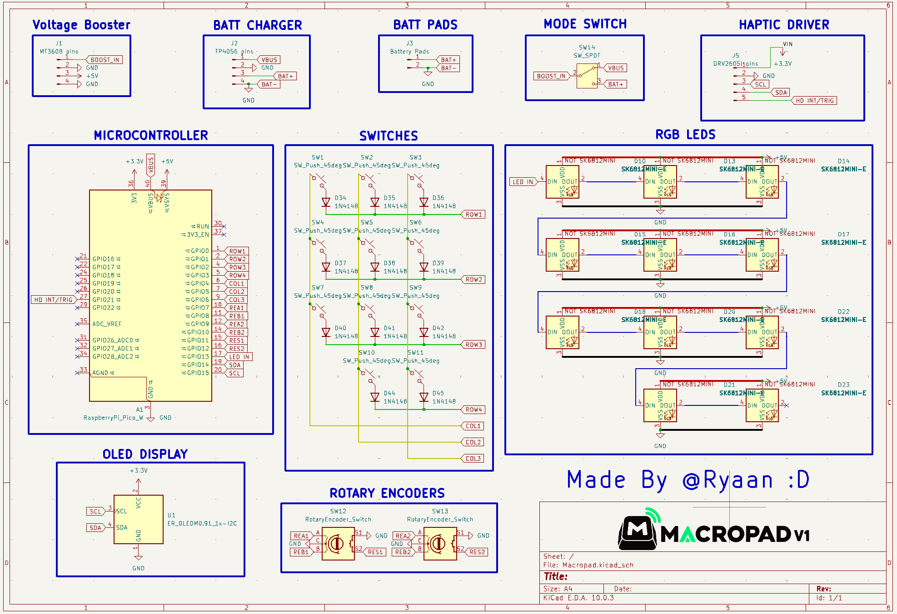
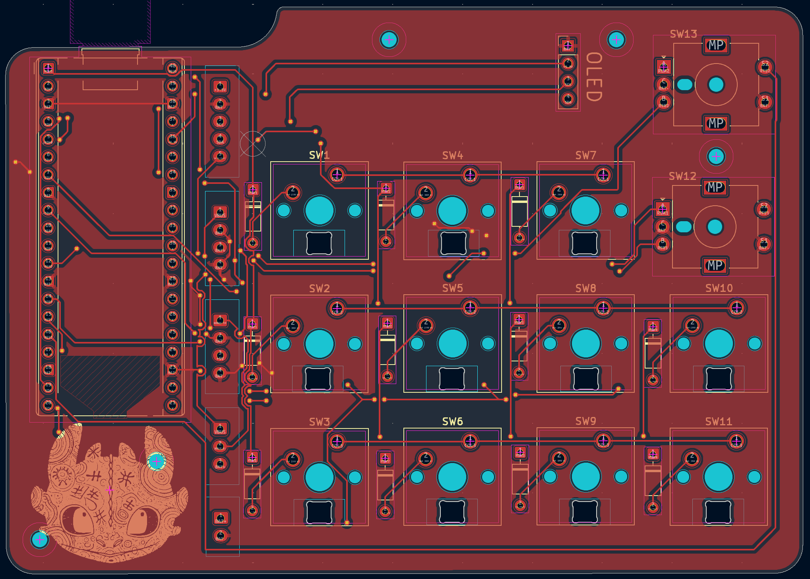
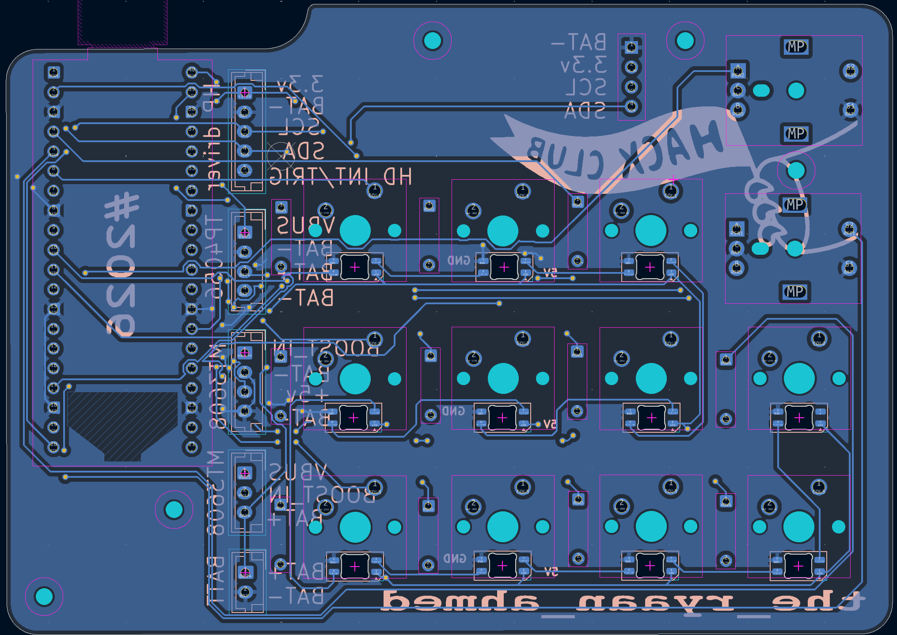
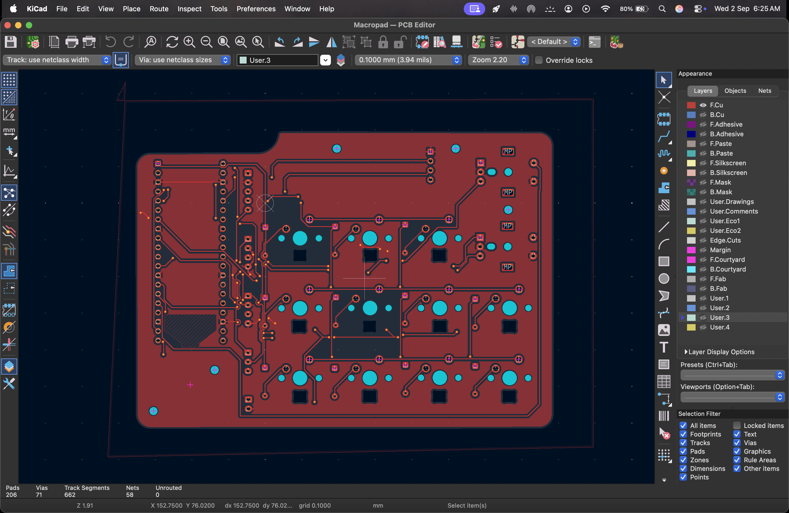
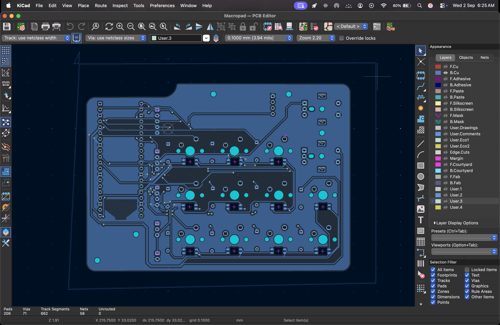

  

<h1 align="center">MACROPAD V1</h1>

  <strong>
    A wireless Raspberry Pi Pico W macropad with RGB lighting,
    rotary encoders, an OLED display and haptic feedback!
  </strong>

  <a href="#key-features">Key Features</a> •
  <a href="#pcb">PCB</a> •
  <a href="#case">Case</a> •
  <a href="#credits">Credits</a> •
  <a href="#license">License</a>

  

I've made this as in my experience off the shelf macropads are way too expensive for the features they offer and are also very generic.
This is an alternative that is actually unique with multiple customizable switches, rotary encoders, a display, Wireless & Wired connectivity and insanely good haptics.

## Key Features

- **11 programmable keys** for custom shortcuts, macros, and commands
- **2 dedicated profile keys** for switching between profiles
- **Dual rotary encoders** for profile selection, volume, endless scrolling, and custom controls
- **OLED display** for showing the active profile and other information
- **Haptic feedback** for responsive physical feedback
- **QMK firmware** for controlling everything through the Pico
- **Vial configuration** for remapping keys and controls without reflashing firmware

## PCB 

Designed in KiCad!

### Schematic

  

### PCB Layout:

**Front:**

  

**Back:** 

  

### Copper Layers:

**F_Cu:**

  

**B_Cu:**

  

Board dimensions: 115mm x 80mm

